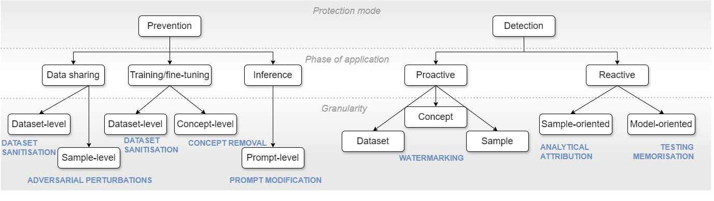

# U Can't Gen This? :sunglasses: A Survey of Intellectual Property Protection Methods for Data in Generative AI

## Overview
This repository contains a collection of methods for intellectual property protection for data in GAI. As the field continuously grows and lacks unified terminology and classification, we propose the taxonomy for these methods.
\
\


:construction_worker: Work in progress.

## Adversarial modifications
* [2020]	Shan et al.	**Fawkes: Protecting Privacy against Unauthorized Deep Learning Models.** _USENIX 2020_. [[paper](https://www.usenix.org/conference/usenixsecurity20/presentation/shan)]
* [2023]	Shan et al. **Glaze: Protecting Artists from Style Mimicry by Text-to-Image Models** _USENIX 2023_ [[paper](http://arxiv.org/abs/2302.04222)]  
* [2023]	Salman et al.	**Photoguard: Raising the Cost of Malicious AI-Powered Image Editing** [[paper](http://arxiv.org/abs/2302.06588)] [[code](https://github.com/MadryLab/photoguard)]
* [2023]	Zheng et al.	**ACE: Understanding and Improving Adversarial Attacks on Latent Diffusion Models** [[paper](http://arxiv.org/abs/2310.04687)] [[code](https://github.com/caradryanl/ACE)]
* [2023]	Ye et al.	**DUAW: Data-free Universal Adversarial Watermark against Stable Diffusion Customization** [[paper](http://arxiv.org/abs/2308.09889)]
* [2023]	Liang et al.	**Adversarial Example Does Good: Preventing Painting Imitation from Diffusion Models via Adversarial Examples** [[paper](http://arxiv.org/abs/2302.04578)] [[code](https://github.com/psyker-team/mist)]
* [2023]	Zhao et al.	**Unlearnable Examples for Diffusion Models: Protect Data from Unauthorized Exploitation** [[paper](http://arxiv.org/abs/2306.01902)] [[code](https://github.com/ZhengyueZhao/EUDP)]
* [2023]	Shan et al.	**Nightshade: Prompt-Specific Poisoning Attacks on Text-to-Image Generative Models** _IEEE S&P 2024_. [[paper](http://arxiv.org/abs/2310.13828)]
* [2023]	Chen et al.	**EditShield: Protecting Unauthorized Image Editing by Instruction-guided Diffusion Models** [[paper](http://arxiv.org/abs/2311.12066)] [[code](https://github.com/Allen-piexl/Editshield)]
* [2023]	Liu et al.	**MetaCloak: Preventing Unauthorized Subject-driven Text-to-image Diffusion-based Synthesis via Meta-learning** [[paper](https://arxiv.org/abs/2311.13127)][[code](https://github.com/liuyixin-louis/MetaCloak)]
* [2023]	Liang et al. **Mist: Towards Improved Adversarial Examples for Diffusion Models** [[paper](http://arxiv.org/abs/2305.12683)] [[code](https://github.com/psyker-team/mist)] 

## Concept removal
* [2023] Gandikota et al. **Erasing Concepts from Diffusion Models** _ICCV 2023_ [[paper](https://arxiv.org/pdf/2303.07345)] [[code](https://erasing.baulab.info/)]
* [2023] Dong et al. **Towards Test-Time Refusals via Concept Negation** _NeurIPS 2023_ [[paper](https://proceedings.neurips.cc/paper_files/paper/2023/hash/54801e196796134a2b0ae5e8adef502f-Abstract-Conference.html)]
* [2023] Kong et al. **Data Redaction from Pre-trained GANs** _SaTML 2023_ [[paper](https://ieeexplore.ieee.org/abstract/document/10136171)]
* [2024] Gandikota et al. **Unified Concept Editing in Diffusion Models** [[paper](https://arxiv.org/pdf/2308.14761)] [[code](https://unified.baulab.info/)]
* [2023] Kumari et al. **Ablating Concepts in Text-to-Image Diffusion Models** [[paper](https://arxiv.org/abs/2303.13516)][[code](https://github.com/nupurkmr9/concept-ablation)]
* [2024] Lu et al. **MACE: Mass Concept Erasure in Diffusion Models.** _CVPR 2024_ [[paper](https://openaccess.thecvf.com/content/CVPR2024/html/Lu_MACE_Mass_Concept_Erasure_in_Diffusion_Models_CVPR_2024_paper.html)] [[code](https://github.com/Shilin-LU/MACE)]
* [2024] Zhao et al. **Separable Multi-Concept Erasure from Diffusion Models** [[paper](https://arxiv.org/pdf/2402.05947)][[code](https://github.com/Dlut-lab-zmn/SRS-ME)]

## Data attribution 
* [2023] Georgiev et al. **The Journey, Not the Destination: How Data Guides Diffusion Models** [[paper](https://arxiv.org/abs/2312.06205)] [[code](https://github.com/MadryLab/journey-TRAK)] 

--- 

## Cite

```
@misc{šarčević2024u,
      title={U Can't Gen This? A Survey of Intellectual Property Protection Methods for Data in Generative AI}, 
      author={Tanja Šarčević and Alicja Karlowicz and Rudolf Mayer and Ricardo Baeza-Yates and Andreas Rauber},
      year={2024},
      eprint={2406.15386},
      archivePrefix={arXiv},
      primaryClass={id='cs.CY' full_name='Computers and Society' is_active=True alt_name=None in_archive='cs' is_general=False description='Covers impact of computers on society, computer ethics, information technology and public policy, legal aspects of computing, computers and education. Roughly includes material in ACM Subject Classes K.0, K.2, K.3, K.4, K.5, and K.7.'},
      howpublished={\url{https://github.com/tasnjascats/GenAI-IP-protection/}
}
```
